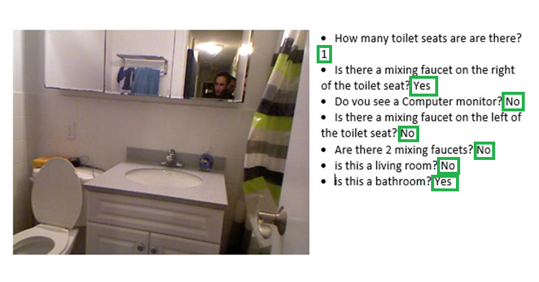

# Lightweight VQA

This Repository contains code of a VQA model. This model is an attempt to create a relatively lightweight VQA model compared to stat of the art models.

# Project structure

There are 3 notebooks on the project : 

* [Install.ipynb](./Install.ipynb) : This notebook sets the working environment, sets the file hierarchy needed and installs some needed data. **NOTE** : Some files may take a long time to download due to their size, for example the VQA dataset.

* [Preprocessing.ipynb](./Preprocessing.ipynb) : This notebook preprocesses the data needed for the model. It treats the VQA dataset by preprocessing the images, questions and answers, it creates from the preprocessed data a set of structured data and save them in ".tfrecord" binary files.

* [VQA_model.ipynb](./VQA_model.ipynb) : This notebook trains the VQA model and generates at the end a file containing the weights of the trained model.

* [Demo](./Demo/) : This directory contains a standalone demo code.

# Prerequirements

## Hardware

This program was tested on a google colab, hence it was tested on the hardware provided by colab.

## Software

 * Ubuntu 18.04
 * Python 3.7
 * Tensorflow 1.14.0 with eager execution
 * Keras 2.2.4-tf

# Dataset

A tool for generating dataset is available on : [VQA Dataset generator](https://github.com/zeryabmoussaoui/VQA-dataset-Generator).

# Training 
In order to train the model, someone has to follow these steps : 
1. Run **_Install.ipynb_**. This is mandatory to have the necessary data for training.
2. Run **_Preprocessing.ipynb_**. The dataset must be preprocessed before training, the result is a preprocessed VQA V2 dataset serialized in binary files.
3. Run **_VQA_model.ipynb_**. The results are weights of the trained model and Tensorboard training log files.

**Note** : Each notebook contains a variables section. Any user must fill the variable with his specific needs to have the notebooks work fine. Generally, the only variable that needs a value assignment is `root_path` which is the directory containing all the needed files. This last is first specified in **_install.ipynb_**, then must have the same value in all notebooks.

# License

## MIT License

Copyright (c) 2019 Nabih Nebbache

Permission is hereby granted, free of charge, to any person obtaining a copy
of this software and associated documentation files (the "Software"), to deal
in the Software without restriction, including without limitation the rights
to use, copy, modify, merge, publish, distribute, sublicense, and/or sell
copies of the Software, and to permit persons to whom the Software is
furnished to do so, subject to the following conditions:

The above copyright notice and this permission notice shall be included in all
copies or substantial portions of the Software.

THE SOFTWARE IS PROVIDED "AS IS", WITHOUT WARRANTY OF ANY KIND, EXPRESS OR
IMPLIED, INCLUDING BUT NOT LIMITED TO THE WARRANTIES OF MERCHANTABILITY,
FITNESS FOR A PARTICULAR PURPOSE AND NONINFRINGEMENT. IN NO EVENT SHALL THE
AUTHORS OR COPYRIGHT HOLDERS BE LIABLE FOR ANY CLAIM, DAMAGES OR OTHER
LIABILITY, WHETHER IN AN ACTION OF CONTRACT, TORT OR OTHERWISE, ARISING FROM,
OUT OF OR IN CONNECTION WITH THE SOFTWARE OR THE USE OR OTHER DEALINGS IN THE
SOFTWARE.

